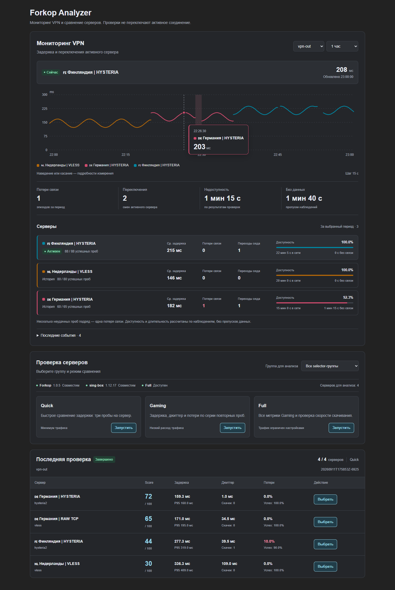

# forkop-analyzer

[](https://github.com/MaksSt/forkop-analyzer/releases/latest)
[](https://github.com/MaksSt/forkop-analyzer/actions/workflows/build-openwrt-apk.yml)
[](LICENSE)


LuCI-приложение и backend для безопасного сравнения VPN-узлов [Forkop](https://github.com/ushan0v/forkop) на OpenWrt. Quick и Gaming используют существующий Forkop Clash API. Full дополнительно измеряет download через отдельный localhost-only instance sing-box и не записывает production-конфиг Forkop.

> Full создаёт реальный benchmark-трафик. Перед запуском проверь `max_traffic_mb`, `full_max_nodes` и условия провайдера подписки.



Скриншот текущего интерфейса v0.2.0 в браузере: настоящие компоненты LuCI, демонстрационные названия серверов и результаты измерений. Мониторинг и чтение истории также проверены на работающем OpenWrt/Forkop; чистая установка APK и Full требуют отдельной live-проверки.

## Возможности

- автоматическое обнаружение Forkop, sing-box, runtime config и Clash API;
- получение selector-групп и безопасного списка outbound tags без передачи subscription secrets во frontend;
- профили Quick, Gaming и Full;
- асинхронные job, прогресс, отмена и очистка временного sing-box;
- атомарное хранение результатов в `/var/lib/forkop-analyzer/results`;
- экспорт JSON и CSV;
- ручное, отдельно подтверждаемое переключение production selector;
- ежедневный scheduler с устойчивым к перезагрузке дневным checkpoint;
- фоновый мониторинг активного VPN-сервера: общий график задержки с цветными участками, разрывами и подсказками;
- статистика эпизодов потери связи, переключений и времени доступности по серверам;
- два независимых APK: `forkop-analyzer` и `luci-app-forkop-analyzer`.

## Мониторинг активного сервера

На странице обзора один график показывает задержку активного конечного сервера внутри выбранной группы. Цвет соответствует серверу, при переключении начинается новый участок. Неудачные проверки отмечены красным фоном и разрывом линии, отсутствие данных — разрывом. Наведение, касание и клавиши ←/→ показывают время, имя сервера и результат проверки. Доступны периоды 1, 6 и 24 часа, сводка, таблица по серверам и последние события.

Отдельный procd instance делает одну latency-пробу через активный сервер каждые 15 секунд, даже при закрытом LuCI. Настройки: `monitor_enabled`, `monitor_selector`, `monitor_interval` (10–300 секунд). Пустой `monitor_selector` выбирает `vpn-out`, затем первую selector-группу. Смена группы для сбора задаётся в настройках; выбор группы на графике просматривает уже собранную историю. Применение настроек перезапускает сервис через штатный UCI reload trigger.

История хранится только в RAM: `/var/run/forkop-analyzer-monitor/history.json`, до 24 часов и 8641 измерения. Перезапуск analyzer сохраняет её, перезагрузка роутера очищает. Чтение: `forkop-analyzer monitor` или ubus `forkop-analyzer monitor` (read ACL). RPC только читает готовую историю.

В истории сервер определяется по группе, runtime tag и названию на момент измерения. Изменение названия при прежнем tag создаёт отдельную строку статистики и новый участок графика; старые наблюдения сохраняют своё имя. Возврат к той же комбинации продолжает её историю.

Потеря связи здесь — эпизод неудачных запросов к latency endpoint через активный сервер, а не счётчик TCP disconnect или ICMP/UDP packet loss. Несколько неудачных проб подряд считаются одним эпизодом. Переключение без неудачной пробы учитывается отдельно. Неизвестный маршрут, недоступный API и смена сервера во время пробы не считаются подтверждённой потерей связи. Задержка старых проб из Clash history не используется. Длительности приблизительны; события между измерениями могут быть пропущены. После паузы более двух интервалов плюс 5 секунд линия не соединяется, пропуск не включается в доступность сервера.

## Интерфейс

Обзор, история и настройки используют общий адаптивный дизайн со светлой и тёмной темами. Совместимость компонентов показана компактной строкой, профили Quick/Gaming/Full — карточками, текущая проверка — блоком прогресса. В результатах сгруппированы задержка/P95, джиттер/скачки, потери/успешность; скорость скачивания показывается для Full.

Подсказка графика появляется рядом с курсором или выбранной с клавиатуры точкой. Под графиком расположены сводные показатели, карточки статистики серверов и события. История содержит отдельные строки запусков с просмотром результатов и экспортом. Настройки разделены на вкладки; штатные Save/Reset LuCI сохраняют оформление. Версионированные пути ресурсов обновляют кэш интерфейса после установки.

## Архитектура

```text
LuCI JavaScript
      │ ubus + ACL
      ▼
rpcd ucode plugin ──► forkop-analyzer CLI ──► async worker
                                                │
                      forkop_adapter.uc ◄───────┤
                         │                      ├─ Clash API latency
                         │                      └─ temporary sing-box (Full)
                         ▼
             /usr/bin/forkop + runtime config
```

`forkop_adapter.uc` — единственная часть проекта, которая знает внутренние пути и актуальный CLI contract Forkop. Frontend и worker не читают Forkop напрямую. Подробности: [docs/ARCHITECTURE.md](docs/ARCHITECTURE.md) и [docs/FORKOP_RESEARCH.md](docs/FORKOP_RESEARCH.md).

## Проверенная совместимость

| Компонент | Проверенная база |
|---|---|
| OpenWrt | 25.12.4, `apk`, официальный `armsr/armv8` SDK |
| Forkop | `1.0.5`, commit `dd483297be0ac4e52bb8f482e2640238b75af532` |
| sing-box | contract `1.12.4+`; точный router binary в dev-среде отсутствовал |
| LuCI reference | `MaksSt/luci-app-cloudflareapi` commit `6bcbec79690b864c3f0f670f24bb68f255169cb6` |
| Дата проверки исходников | 2026-08-06 |

Указанный Forkop commit — база статической проверки UCI, generator, runtime, CLI и LuCI ACL. Дополнительно мониторинг проверен на OpenWrt 25.12.5, Forkop 1.0.5 и sing-box 1.12.17: фоновый сбор, RPC-история и сохранение имён при переиспользовании tag. Область проверок и оставшиеся проверки установки описаны в [docs/TESTING.md](docs/TESTING.md).

## Требования

- OpenWrt 25.12.x с `apk`;
- установленный и запущенный Forkop `>= 1.0.5`;
- sing-box `>= 1.12.4` для Full;
- доступный Forkop runtime config;
- хотя бы одна selector-группа с proxy outbounds;
- свободный localhost port из диапазона, начинающегося с `isolated_port_base`.

Backend использует только заявленные зависимости: `forkop`, `curl`, `coreutils-timeout`, `ca-bundle`, `jsonfilter`, `ucode`, `ucode-mod-fs`, `ucode-mod-uci`, `rpcd-mod-ucode`.

## Установка через LuCI Software

В OpenWrt 25.x поле **Download and install package** может выполнить `apk add <введённое значение>`. GitHub URL там может интерпретироваться как имя пакета и завершиться `no such package`.

Надёжный способ:

1. Скачай из [GitHub Release v0.2.0](https://github.com/MaksSt/forkop-analyzer/releases/tag/v0.2.0):
   - `forkop-analyzer-0.2.0-r1.apk`;
   - `luci-app-forkop-analyzer-0.2.0-r1.apk`;
   - `SHA256SUMS`.
2. Сверь SHA-256.
3. Открой **System → Software → Upload Package**.
4. Загрузи сначала `forkop-analyzer-0.2.0-r1.apk`.
5. Затем загрузи `luci-app-forkop-analyzer-0.2.0-r1.apk`.
6. Обнови страницу LuCI. Интерфейс появится в **Services → Forkop Analyzer**.

Не вставляй GitHub URL в поле **Download and install package**: этот путь не проверен на целевой версии.

## Установка через SSH

```sh
wget -O /tmp/forkop-analyzer.apk \
  https://github.com/MaksSt/forkop-analyzer/releases/download/v0.2.0/forkop-analyzer-0.2.0-r1.apk

wget -O /tmp/luci-app-forkop-analyzer.apk \
  https://github.com/MaksSt/forkop-analyzer/releases/download/v0.2.0/luci-app-forkop-analyzer-0.2.0-r1.apk

apk add --allow-untrusted \
  /tmp/forkop-analyzer.apk \
  /tmp/luci-app-forkop-analyzer.apk

/etc/init.d/forkop-analyzer enable
/etc/init.d/forkop-analyzer restart
/etc/init.d/rpcd restart
```

Удобный installer:

```sh
wget -O /tmp/install-forkop-analyzer.sh \
  https://raw.githubusercontent.com/MaksSt/forkop-analyzer/main/install.sh
sh /tmp/install-forkop-analyzer.sh --version v0.2.0
```

`install.sh` проверяет OpenWrt/apk, Forkop, package architecture и `SHA256SUMS`; TLS verification не отключается. Доступны `--prerelease`, `--no-start`, `--uninstall`, `--help`.

## Обновление

Скачай оба APK нового релиза и выполни:

```sh
apk add --allow-untrusted \
  /tmp/forkop-analyzer.apk \
  /tmp/luci-app-forkop-analyzer.apk
/etc/init.d/forkop-analyzer restart
/etc/init.d/rpcd restart
```

Команда соответствует installer v0.2.0, но ещё не проверена на чистом live OpenWrt 25.12.4.

## Удаление

```sh
/etc/init.d/forkop-analyzer stop
apk del luci-app-forkop-analyzer forkop-analyzer
```

Удаление останавливает собственный worker и временный sing-box, но не удаляет Forkop, sing-box или их конфигурацию. UCI conffile следует стандартному поведению package manager. История в `/var/lib/forkop-analyzer/results` сохраняется как пользовательские данные; удали её вручную только если она больше не нужна.

## Настройка Forkop

1. Настрой подписку и connection section в Forkop.
2. Убедись, что Forkop и sing-box запущены.
3. Проверь, что section создал selector в dashboard Forkop.
4. Открой Forkop Analyzer. Adapter получит tags из текущего runtime config и Clash API.

Analyzer не парсит VLESS/Hysteria2 links и не дублирует subscription parser Forkop. URL подписки, credentials, server address и Clash secret не возвращаются в LuCI.

## Test endpoint

Forkop задаёт latency URL в `forkop.settings.latency_test_url`; Quick/Gaming вызывают upstream `forkop clash_api get_proxy_latency`, поэтому не подменяют этот выбор.

Full использует `forkop-analyzer.main.download_url`. Default:

```text
https://nbg1-speed.hetzner.com/1GB.bin
```

Endpoint должен отвечать по HTTPS. По умолчанию Analyzer использует официальный тестовый файл Hetzner размером 1 GiB и загружает его одним запросом через отдельный sing-box. `download_bytes` и `download_chunk_bytes` равны `1073741824`, `download_timeout_seconds` даёт медленному узлу до 15 минут, а `max_traffic_mb` задаёт общий budget job. При стандартных 15 узлах верхняя граница трафика одного запуска — 15 GiB.

## Профили

- **Quick** — 3 latency-пробы на leaf outbound. Подходит для первичной сортировки.
- **Gaming** — 20 latency-проб. Основной вес у latency и jitter; не генерирует throughput download.
- **Full** — 8 latency-проб и download 1 GiB на узел через отдельный sing-box. По умолчанию не больше 15 узлов и 15 GiB на job.

Число проб и лимиты настраиваются в LuCI. Временный sing-box получает только выбранный outbound и необходимые независимые DNS-зависимости; production endpoints, включая Tailscale, в него не копируются.

## Метрики

- `latency_ms` — среднее успешных Clash delay samples; принимаются только строгие числовые значения `> 0` и `<= latency_timeout_ms`;
- `latency_min_ms`, `latency_max_ms` — диапазон samples;
- `latency_p95_ms` — 95-й перцентиль успешных samples по методу nearest rank;
- `jitter_ms` — средняя абсолютная разница соседних успешных samples;
- `latency_spikes` — число успешных samples выше `max(1.5 × median, median + 50 ms)`;
- `success_pct` — доля успешных latency-запросов;
- `loss_pct` — доля неудачных Clash HTTP delay requests через проверяемый outbound; это request-loss proxy, а не ICMP/UDP packet loss;
- `download_mbps` — `curl speed_download × 8 / 1 000 000` через isolated SOCKS inbound;
- `score` — итог 0–100.

## Scoring

Нормализация:

- latency: 100 при `<=20 ms`, 0 при `>=300 ms`, линейно между ними;
- jitter: 100 при `0 ms`, 0 при `>=100 ms`;
- reliability: `success_pct`;
- download: 100 при достижении `target_download_mbps`, линейно ниже цели.

Веса:

| Profile | Latency | Jitter | Reliability | Download |
|---|---:|---:|---:|---:|
| Quick | 55% | 15% | 30% | 0% |
| Gaming | 45% | 35% | 20% | 0% |
| Full | 25% | 15% | 15% | 45% |

Формула реализована в одном production-файле `scoring.sh` и покрыта unit tests. Эти веса выбраны для MVP, потому что предоставленное ТЗ не содержало разделов 1–14 с иной формулой.

## Ограничение трафика

Worker проверяет budget перед каждым Full download. Defaults: 1 GiB на узел, максимум 15 узлов и 15 GiB на job. Фактический полученный объём записывается в `traffic_bytes`. Сервер endpoint обязан соблюдать заявленный размер; абсолютную тарификацию со стороны провайдера router измерить не может.

## Безопасность

- production runtime config только читается;
- временный config находится под `/tmp/forkop-analyzer/<job>/` с mode 0700;
- inbound слушает только `127.0.0.1`;
- Clash API вызывается через существующий `/usr/bin/forkop`, поэтому adapter не раскрывает secret;
- benchmark не вызывает `set_group_proxy`;
- ручной **Выбрать** валидирует, что outbound входит в selector;
- при отмене worker посылает TERM только PID с проверенным cmdline;
- selector до/после записывается в result. Если его изменил другой процесс, Analyzer не откатывает чужое изменение.

## Troubleshooting

### Forkop не обнаружен

```sh
/usr/bin/forkop show_version
/usr/bin/forkop get_status
```

Требуется Forkop `>=1.0.5` и `/etc/config/forkop`.

### Clash API недоступен

```sh
/usr/bin/forkop clash_api get_proxies
logread -e forkop
logread -e sing-box
```

Не включай WAN access ради Analyzer: backend использует локальный controller.

### Full недоступен

Проверь capabilities:

```sh
forkop-analyzer capabilities
sing-box version
```

Нужны sing-box `>=1.12.4`, читаемый runtime config, `curl` и свободный localhost port. Наличие production `endpoints` само по себе не блокирует Full: они не копируются в изолированный instance.

### Зависший job

```sh
forkop-analyzer status
forkop-analyzer cancel
forkop-analyzer cleanup
```

## CLI

```sh
forkop-analyzer capabilities
forkop-analyzer selectors
forkop-analyzer nodes
forkop-analyzer start quick
forkop-analyzer start gaming main-out
forkop-analyzer status
forkop-analyzer cancel
forkop-analyzer results
forkop-analyzer export json JOB_ID
forkop-analyzer export csv JOB_ID
```

`forkop-analyzer select SELECTOR OUTBOUND` — отдельная mutating-команда; benchmark её не вызывает.

## Сборка через официальный SDK

Внутри распакованного OpenWrt 25.12.4 SDK:

```sh
git clone https://github.com/ushan0v/forkop.git /tmp/forkop-upstream
git -C /tmp/forkop-upstream checkout dd483297be0ac4e52bb8f482e2640238b75af532
cp -a /tmp/forkop-upstream/forkop ./package/forkop

cp -a /path/to/forkop-analyzer/forkop-analyzer ./package/forkop-analyzer
cp -a /path/to/forkop-analyzer/luci-app-forkop-analyzer ./package/luci-app-forkop-analyzer

make defconfig
make package/forkop-analyzer/compile V=s
make package/luci-app-forkop-analyzer/compile V=s
```

GitHub Actions скачивает SDK только с `downloads.openwrt.org`, проверяет SDK по official `sha256sums`, pin-ит Forkop commit, собирает оба APK, проверяет contents/dependencies и формирует детерминированные assets:

- `forkop-analyzer-0.2.0-r1.apk`;
- `luci-app-forkop-analyzer-0.2.0-r1.apk`;
- `SHA256SUMS`.

Workflow запускается на push в `main`, pull request с изменениями кода/сборки и вручную. Push в `main` сохраняет APK в **Actions → Artifacts**; GitHub Release автоматически создаётся при push тега `v*`, совпадающего с версией пакетов. Ручной запуск публикует релиз только при включённом `upload_release`.

Перед выпуском синхронизируй версии обоих Makefile, installer, workflow, проверок и ссылок README, затем выполни `scripts/check-version.sh`. Существующий тег разрешено пересобирать только из того же коммита: для нового кода нужна новая версия.

## Тестирование

```sh
scripts/check-version.sh
scripts/validate.sh
tests/run.sh
```

На OpenWrt после установки:

```sh
ubus -v list forkop-analyzer
ubus call forkop-analyzer capabilities
forkop-analyzer start quick
forkop-analyzer status
forkop-analyzer cancel
```

SDK build — основная integration check. Live checks start/stop/restart, cancel, selector invariants и clean installation требуют отдельного OpenWrt 25.12.4 router/VM.

## Известные ограничения

- Quick и Gaming проверены на реальном OpenWrt 25.12.5 с Forkop; Full требует отдельной live-проверки.
- Full измеряет download, но не upload.
- `loss_pct` основан на неудачных HTTP delay requests через outbound, это не ICMP/UDP packet loss.
- Benchmark не определяет географию и не ранжирует цену/лимиты подписки.
- Изменение selector другим процессом во время job фиксируется, но не откатывается.
- OpenWrt `opkg` не поддерживается.

## Лицензия

[MIT](LICENSE). Forkop и luci-app-cloudflareapi не включены в этот репозиторий и сохраняют собственные лицензии.
